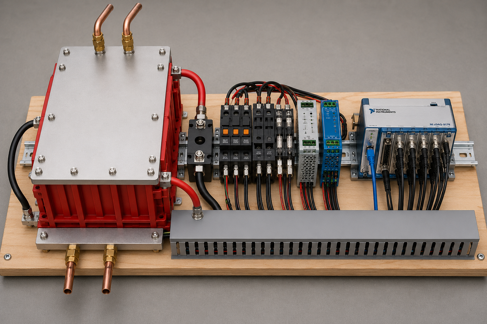
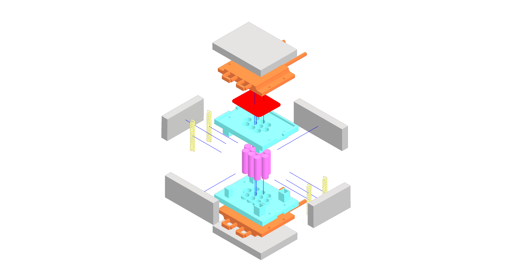

# Camden V0.2.2
This version puts the pack onto a back borad with a DIN Rail

This project uses KiCAD 9.0.5 https://downloads.kicad.org/kicad/windows/explore/stable/download/kicad-9.0.5-x86_64.exe and Inventor 2025 Q2

   

 Desing vison image of the proposed SPARC system.

   

 The battery pack design.

